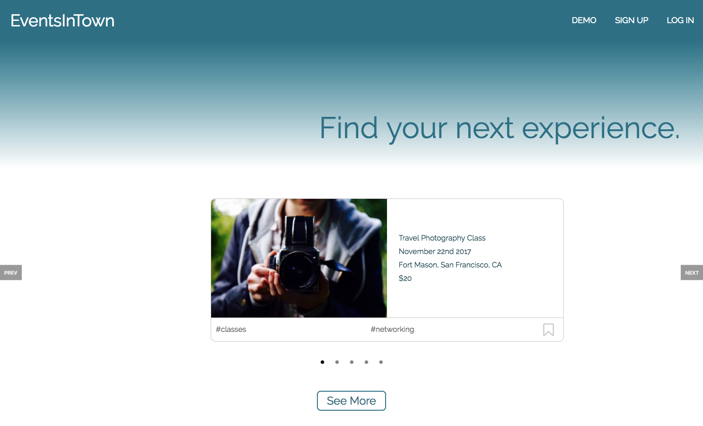
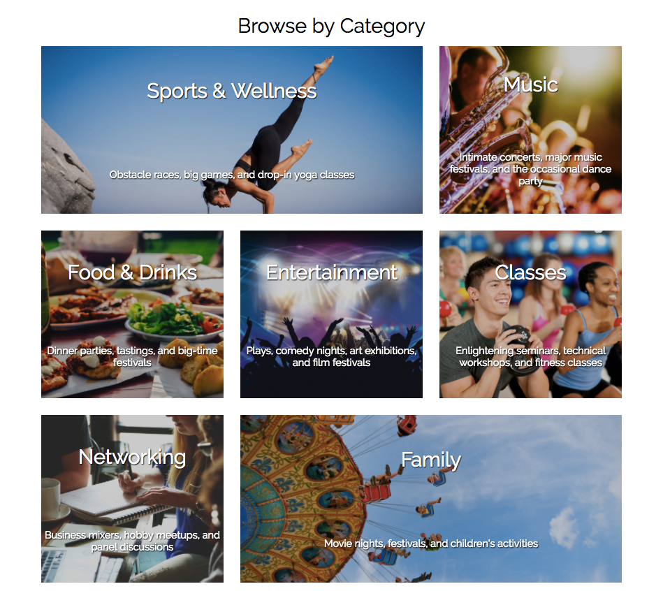
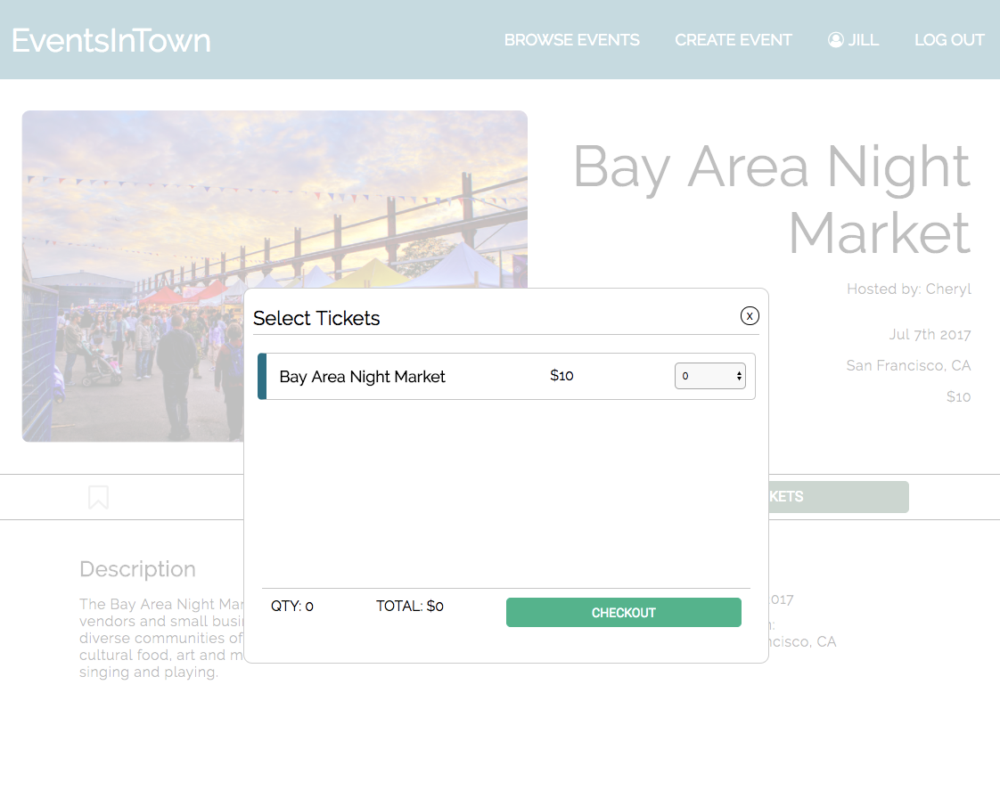

# EventsInTown

[EventsInTown live link](https://eventsintown.herokuapp.com/#/)

EventsInTown is a web application inspired by Eventbrite allowing users to discover events that match their interests, bookmark events for later viewing, purchase tickets, or create and host their own events with online ticketing. EventsInTown was built using a PostgreSQL database, Ruby on Rails, and React, implementing Redux methodology.

## Technologies
EventsInTown is a full stack web application that utilizes Ruby on Rails, PostgreSQL and React. Rails was used as a back-end MVC for fetching data from the PostgreSQL database. Because Rails generates HTML, CSS, and JavaScript files, it was easy to write and incorporate the whole front end of my application using JavaScript's React library. Using the Redux methodology, I was able to build a single page web application. I used Cloudinary to host my images and Heroku to deploy my web application.

## Implementation and Features
EventsInTown allows users to:
* Create user account and log in with secure authentication
* Create and edit events hosted by them
* View events
* Filter events by category
* Bookmark events
* Register or Purchase Tickets

### Landing Page
When users first navigates to EventsInTown, they are directed to the landing page. On the landing page, they are able to scroll through a carousel of a few events in the area. On clicking the event, they are directed to the event's detail page. They are able to sign up, log in or browse events through the navigation bar at the top of the page. When clicking sign up or log in, a modal opens



### Categories
Events consist of the event details and category tags. The events can be filtered by individual categories by clicking either the corresponding image on the landing page or from the sidebar link on the category browse page. The categories are filtered on the back-end through association based on the current user who is signed in.



### Tickets
Users are able to register or purchase tickets for an event through the event detail page. When clicked, a modal opens allowing the user to select an amount of tickets and checkout. The event is added to the user's profile page under the user's tickets.



### Bookmarks
Users can bookmark events by click the bookmark icon. If users are not signed in, the bookmark opens the modal to allow users to sign up or log in. The functionality of the bookmark icon toggles between selected and unselected, filling in the bookmark if the user chooses to bookmark the event. The event is added to the user's bookmarked events, which they can view on his/her profile page. This is all handled through a `bookmark` join table connecting the `event_id` and the `user_id`.

### User's Events
User's Events Code Snippet:

```javascript

  renderComponent() {
    const { id } = this.props.currentUser;
    const { pathname } = this.props.location;

    if (pathname === `/users/${id}/tickets`) {
      return this.props.userTickets;
    } else if (pathname === `/users/${id}/events`) {
      return this.props.userHosted;
    } else if (pathname === `/users/${id}/bookmarks`) {
      return this.props.userBookmarks;
    }
  }

  userEvents() {
    const events = this.renderComponent();

    if (events) {
      return (
          <div className="user-events">
            {events.map((eventDetail, idx) => (
              <EventIndexItem
                key={`eventDetail-${idx}`}
                eventDetail={eventDetail} />
            ))}
          </div>
      );
    }
  }

```
The user can host, bookmark, or register/purchase tickets to events. The user state holds arrays of events. The definition of variable `events` changes, as shown in the snippet above, and renders the different `EventIndexItem` components based on the slice of state.

## Future Updates

I plan on dedicating more time to EventsInTown to implement the following features:

* Google Maps integration
* Search bar
